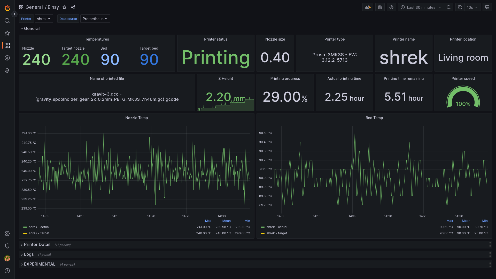

[](https://github.com/pstrobl96/buddy-prometheus-exporter/actions/workflows/ci.yml)    

# Buddy Link Prometheus Exporter

This is an implementation of Prometheus Exporter for Prusa printers running boards named Buddy or Einsy (with Prusa Link installed) like Prusa MK4, XL, Mini or MK3S. Multi-target is supported so you can check any number of printers as long it has accessible Prusa Link API (Even the old Prusa Connect Local).

However with Einsy boards - that in MK3, you need to use newest version of Prusa Link which is 0.7.0rc3 because there are much more metrics to scrape than in older version. You can find it in [Prusa Link repository](https://github.com/prusa3d/Prusa-Link/tree/0.7.0rc3).

- [Where to find exporter](#where-to-find-exporter)
- [Roadmap](#roadmap)
- [Environment variables](#environment-variables)
- [How to install exporter](#how-to-install-exporter)
  * [Docker Compose](#docker-compose)
    + [Config](#config)
      - [buddy.yaml](#buddyyaml)
      - [prometheus.yml](#prometheusyml)
      - [promtail.yml](#promtailyml)
    + [Starting](#starting)
- [Grafana Dashboards](#grafana-dashboards)
  * [Buddy](#buddy)
  * [Legacy](#legacy)
  * [Einsy](#einsy)

## Where to find exporter

Exporter runs at port 10009, but you can choose different port with `BUDDY_EXPORTER_PORT` environment variable. Metrics are accessible at `/metrics` endpoint.

## Roadmap

This list contains what would be implemented in the future.

- [x] Scrape of metrics from [Prusa Link](https://github.com/prusa3d/Prusa-Link/tree/0.7.0rc3)
- [x] Use of Grafana Cloud
- [x] CI pipeline with Docker Hub publish
- [ ] Local instance of Grafana / Prometheus / Loki
- [ ] Raspberry Pi Image
- [ ] Odroid C4 Image
- [ ] [Helm chart](#20) for K8s
- [ ] Camera image [logging](#18)
- [ ] Implementation with [exporter-toolkit](#22)
- [ ] Support for [connection](#21) to Einsy with username and password
- [ ] Show printed [gcode](#19) in dashboard

## Environment variables

`BUDDY_EXPORTER_CONFIG` - path to exporter buddy.yaml config file  
`BUDDY_EXPORTER_PORT` - port where metrics would be exposed  
`BUDDY_EXPORTER_SCRAPE_TIMEOUT` - timeout for printer scraping - not for Prometheus scrape

## How to install exporter

### Docker Compose

I've created docker-compose.yaml file, that can be used for deploy of exporter. You would need [Docker](https://docs.docker.com/engine/install/) and [docker-compose](https://docs.docker.com/compose/install/linux/) plugin installed. Right now it is possible to use `docker compose up` only with Linux because I do not build image for Linux.

#### Config

In [config](docs/examples/config) folder are configuration files for exporter itself, Prometheus and Promtail. You need change few thing here and there to get it up and running. Of course you can change everything you want. Every api key for Grafana Cloud cloud be found in [grafana.com](https://grafana.com/) -> My Account -> Grafana Cloud instance -> Send Metrics / Send Logs.

Configuration files needs to be placed in directory config. You can just copy folder from examples and it will work.

```
cp -r docs/examples/config config
```
##### buddy.yaml

Exporter loads [buddy.yaml](docs/examples/config/buddy.yaml) (file with connections to printers) from environment variable called `BUDDY_EXPORTER_CONFIG`. If you want to put this file in folder, where exporter is located then just set it to `buddy.yaml`. This file is loaded only at start of exporter so be sure restart it after change.

In code block bellow you can see template for buddy.yaml config file. Value of `type` is not that important, you can set anything you want. However this value would be written to labels in metrics, so be aware of that.

Unfortunately for Einsy boards there is no way how to log with username and password. You need to generate apikey in Prusa Link settings. This would be resolved in future release.

```
printers:
  buddy:
  - address: <address_of_printer>
    name: <your_printer_name>
    type: mini
    apikey: <your_printer_apikey>
  - address: <address_of_printer>
    username: maker # I'm not aware that there is posibility to change user name in XL or MK4 printers - default is maker
    pass: <password>
    name: <your_printer_name>
    type: <mini/xl/mk4>
  einsy:
  - address: <address_of_printer>
    apiKey: <your_printer_apikey>
    name: <your_printer_name>
    type: <mk2.5 or mk3>
  legacy:
  - address: <address_of_printer>
    name: <your_printer_name>
    type: mini
```

##### prometheus.yml

In [prometheus.yml](docs/examples/config/prometheus.yml) you need to change remote write block. This block is responsible for writing data to Grafana Cloud instance. You can get all values in config of your Grafana instance. You can get more information in [Grafana Docs](https://grafana.com/docs/grafana-cloud/data-configuration/metrics/metrics-prometheus/).

| key      | value                                  |
|----------|----------------------------------------|
| url      | this is where your instance is running |
| username | name that is used for login            |
| password | unique key used for login              |

```
remote_write:
- url: https://prometheus-prod-01-eu-west-0.grafana.net/api/prom/push
  basic_auth:
    username: "userName"
    password: "apiKey"
```

##### promtail.yml

In [promtail.yml](docs/examples/config/promtail.yml) you need to change clients block. Thanks to this block promtail would sent logs to Grafana Cloud Loki instance instead of local Loki. More details of log ingestion in [Grafana docs](https://grafana.com/docs/grafana-cloud/data-configuration/logs/collect-logs-with-promtail/).

| key      | value                                                 |
|----------|-------------------------------------------------------|
| url      | this is string that you can generate in Grafana Cloud |

```
clients:
  - url: https://<User Name>:<Your Grafana.com API Key>@logs-prod-eu-west-0.grafana.net/loki/api/v1/push
```

#### Starting

Starting of exporter is simple. Just change directory to where docker-compose.yaml and configs are and run following command.

```
docker compose up
```

:tada: if everthing went alright your instance is up and running and you can find metrics at [/metrics](http://localhost:10009/metrics) endpoint.

## Grafana Dashboards

I also prepared one dashboard per board that you can find in grafana folder.

### Buddy


### Legacy


### Einsy


