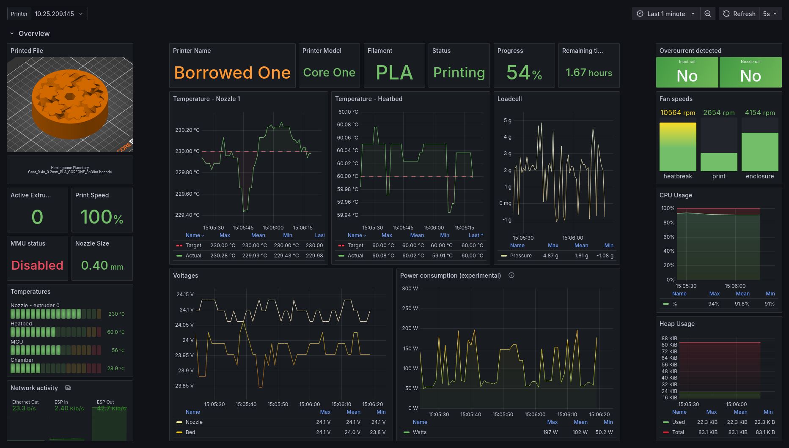

[](https://github.com/pstrobl96/prusa_exporter/actions/workflows/docker.yml) 
[](https://github.com/pstrobl96/prusa_exporter/actions/workflows/rpi.yml) 
 
 
 


# prusa_exporter

If you've seen this repository before, you've probably noticed some minor changes. Basically I removed most of the features because `feature-creep` was getting worse and worse and I'm aiming for a simpler setup and much higher quality code, so version 1.0.0 is skipped and `Vistaized` - the first final version will be 2.0.0.

- [ ] [prusa_metric_handler](https://github.com/pstrobl96/prusa_metrics_handler) integration for getting syslog metrics
- [ ] [prusa_log_processor](https://github.com/pstrobl96/prusa_log_processor) integration for log processing
- [ ] [prusa_exporter](https://github.com/pstrobl96/prusa_exporter) to process metrics from Prusa Link in addition to logs and syslog metrics. It's like a package for all three components.

## Omega2

*Why Omega?*

*Omega development stage name was choosed when Microsoft d\*cked up Windows Vista development and restarted the development. One of the first known builds was Omega13.*

The Omega2 version is the one you could see at the Grafana / Prusa stand at FOSDEM 2025. This setup works for more than one printer, but the problem is that the prusa_metrics_handler is pretty greedy on computational resources. However, it works quite well for one printer - it should work for multiple printers, but it's not tested. I've set up one dashboard that works with metrics from both Prusa Link and prusa_metrics_handler, so both need to be configured. 

**prusa_metrics_handler** is configured in printer - Settings -> Network -> Metrics & Log

- Host => address where prusa_metrics_handler is running
- Metrics Port => default 8514 same as prusa_metrics_handler but you can change it
- Enable Metrics => enable
- Metrics List => list of enabled metrics
  - You can select all but it has actual impact on performance so choose wisely

List of metrics needed for dashboard
- ttemp_noz
- temp_noz
- ttemp_bed
- temp_bed
- chamber_temp
- temp_mcu
- temp_hbr
- loadcell_value
- curr_inp
- volt_bed
- eth_out
- eth_in

Of course you can configure metrics with gcode as well

```
M330 SYSLOG
M334 192.168.20.20
M331 ttemp_noz
M331 temp_noz
M331 ttemp_bed
M331 temp_bed
M331 chamber_temp
M331 temp_mcu
M331 temp_hbr
M331 loadcell_value
M331 curr_inp
M331 volt_bed
M331 eth_out
M331 eth_in
```

**prusa_exporter** is configured with [prusa.yml](docs/config/prusa.yml) where you need to fill - Settings -> Network -> PrusaLink

- `address` of the printer
- `username` => default `maker`
- `password` for Prusa Link
- `name` of the printer
  - your chosen name => just use basic name non standard - type
- `type` - model of the printer
  - MK3.9 / MK4 / MK4S / XL / Core One ...

### Dashboard

Pretty basic but nice and cozy [dashboard](docs/config/grafana/provisioning/dashboards/Prusa%20Metrics%20TV-1737915696031.json) for TV.



